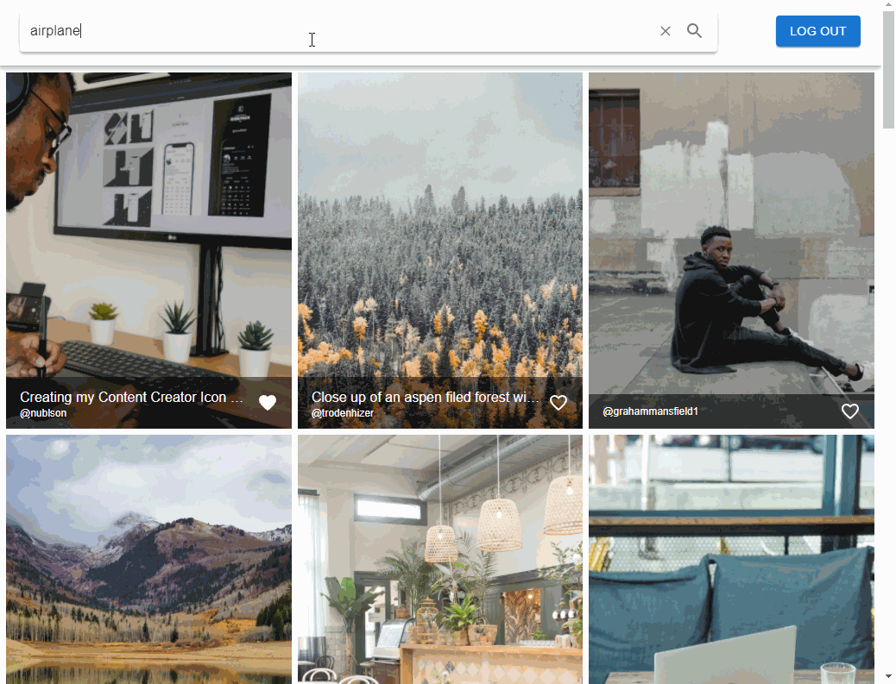

# Unsplash Image Search

This application was created for some demo purposes. It basically uses Unsplash APIs to search and like/dislike images

## How to set up

1. Run ``yarn install`` to install needed dependencies
2. Add Unsplash API Client ID and Client Secret to .env (as ``REACT_APP_CLIENT_ID`` and ``REACT_APP_CLIENT_SECRET``)
3. Add ``http://localhost:3000/login`` as Redirect URI in Unsplash App settings (``write likes access`` permission should also be enabled)
4. Run ``yarn start`` to start the project

